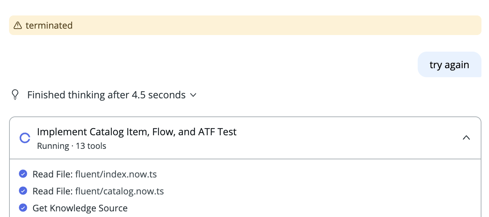
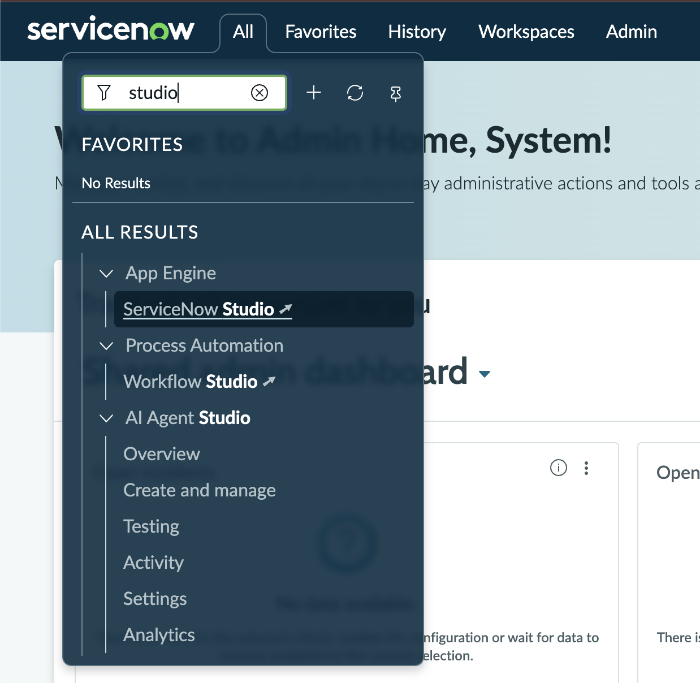
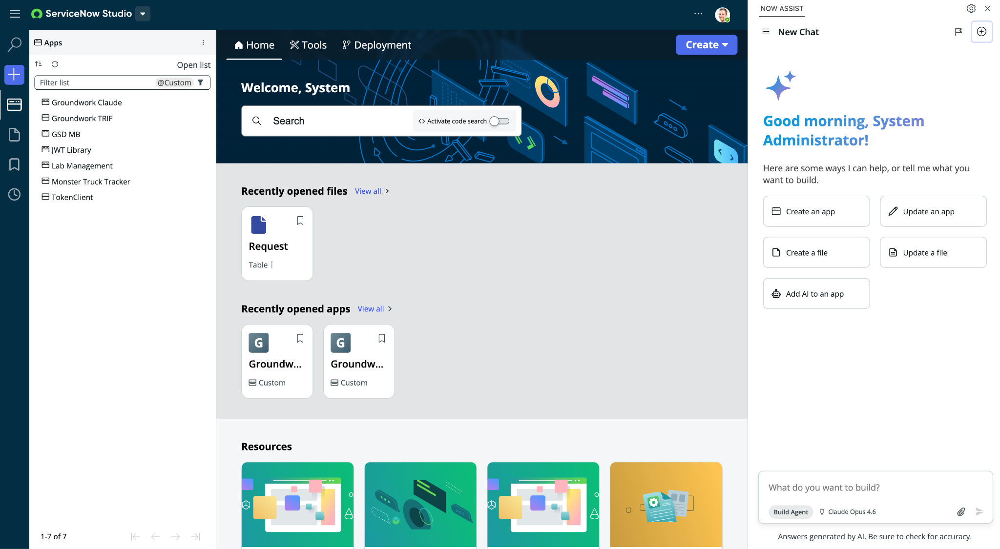

# Build Agent on ServiceNow

### Ship Your Backlog with Enterprise Vibe Coding

This morning you will do a couple of activities like what you or your team do at work: scaffold an app, put a front door on it, pull in a backlog, implement a story from it, and document what you built. An AI agent does the heavy lifting while you supervise.

By noon you will have a working application called Groundwork that you scaffolded, exposed through **Employee Center** or Service Portal, extended from real user stories, and documented, all through conversation with Build Agent.

In the afternoon ([Build Anywhere](../build-anywhere/README.md)) you do it again from the outside: connect to that same app from a GitHub Codespace, implement another story, and add an AI skill, driving Claude Code and the ServiceNow SDK from the command line. Same platform, same governance, a different cockpit.

## What we will accomplish this morning

By the time you leave you will have done a full slice of platform work with an agent as your pair.

| Lab | What you build | The skill underneath |
|---|---|---|
| 1 · Foundational app | A working app: table, fields, sample data, navigation | Turning one prompt into a running app |
| 2 · Catalog front door | An Employee Center or Service Portal catalog item that creates requests | The quality of the provided requirements directly impacts the quality of the generated code |
| 3 · Load backlog | Eight user stories loaded into the platform backlog | Getting real-world input into the platform |
| 4 · Implement a story | One backlog story taken to done against its acceptance criteria | Reviewing an agent's plan and holding the line |
| 5 · Document | A README and architecture diagram generated from the app | Documentation as the zero-risk agent task |

You will finish with an app that is foundational, fronted by a catalog item, extended by a story you implemented, and documented, plus a feel for where the human stays in the loop.

## How this lab works

Every prompt you send follows the same loop:

1. **Prompt.** Describe what you want in plain language.
2. **Plan.** Build Agent shows you what it intends to create before touching anything. You are the human in the loop.
3. **Approve.** Read the plan, then approve it. Approving does not count as a new prompt.
4. **Verify.** Open what it built. Click around. Check it against what you asked for.
5. **Iterate.** Not quite right? Describe the change. Instead of starting over, always iterate.

Agent builds generally take three to six minutes. The more complex the prompt and the plan created, the longer the build.


**TIP — Good to know.** Build Agent currently requires the admin role. Your lab instance gives you admin, which is why everything works today. Back home, plan for who gets access. One well-scoped prompt beats four small ones. Draft longer prompts in a text editor first, then paste.


## Working with Build Agent chats

A **Build Agent** conversation is a working session, not a permanent record. Your changes are saved to the platform (and to update sets) as you approve them; the chat is just the thread that produced them. Treat chats as disposable. If you need to create a summary of changes implemented in a chat session, ask Build Agent to document them itself.

Start a fresh chat when:

* **You switch to an unrelated task.** One conversation per logical unit of work keeps the change log grouped cleanly and checkpoints easy to reason about. For this workshop, we will likely use just one chat, unless we run out of context for our current window.
* **The agent starts looping, contradicting itself, or dragging.** Long threads accumulate context; a clean chat often fixes a confused agent faster than arguing with it.
* **You reloaded the window and your attachment disappeared.** Uploads live only in the current conversation and do not survive a reload.
* **You get a "terminated" error.** We are using lab instances, with fewer allocated resources than any of your customer instances, and more similar to a Personal Developer Instance. If this error appears, simply prompt **Build Agent** to "try again" and it should pick up from where it left off. If you get this error repeatedly, start another chat and point it at your existing application.


**Tip: attach and prompt together.** Whenever a task needs a file, attach it and send your instruction in the same message. If you attach, then reload, then prompt, the agent will not see the file. Confirm the attachment chip appears before you send.


## Before you begin

* Reserve your instance using the link and code on screen. Log in with the credentials provided through the instance reservation page. Keep this page open, we will need it later.
* Navigate to **All > App Engine > ServiceNow Studio**. You might have to wait for 20-30 seconds for the **All** menu to load when the instance has just been claimed.

* The Build Agent chat panel opens by default in new Studio sessions. If it is not open, select Open Build Agent from the status bar in the lower right corner, or the sparkle icon in the banner (upper right).


**IMPORTANT — Raise** your hand at any point. Floor support is here for exactly this.


Ready? Start with [Lab 0: Setup and a Parallel Start](lab-0-setup.md).
