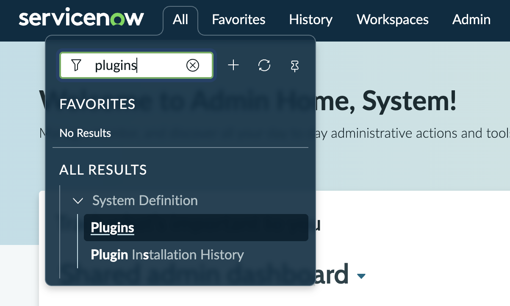
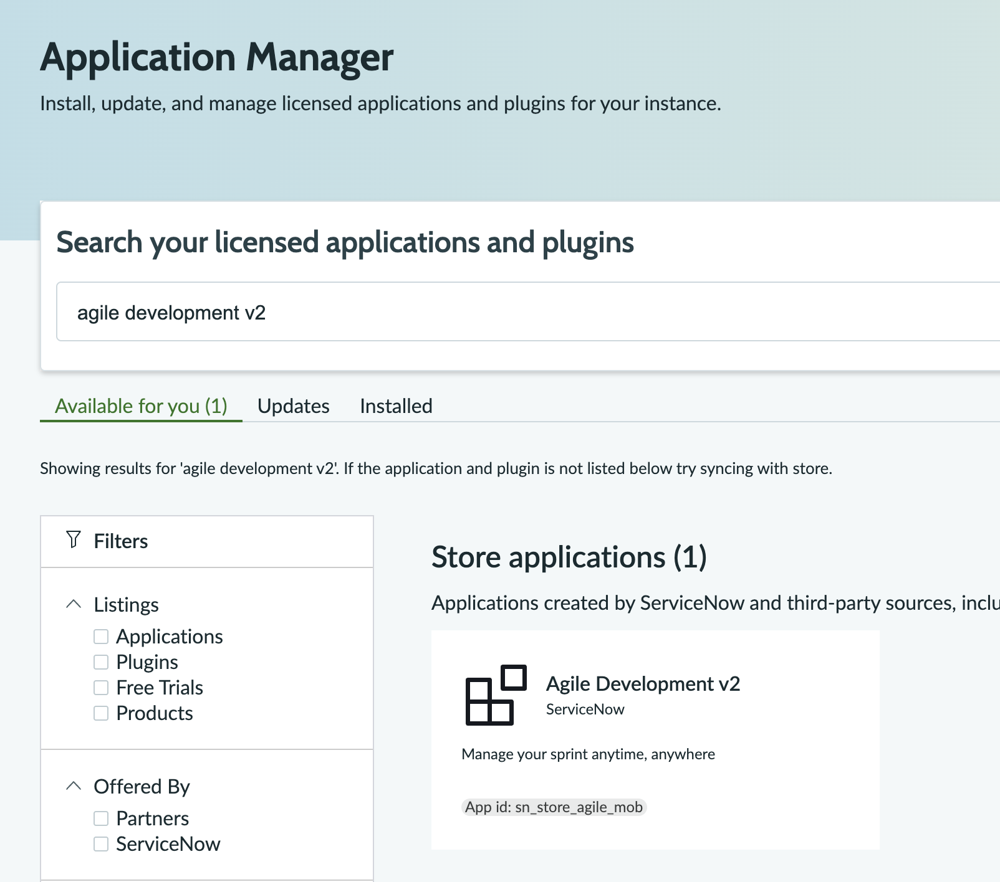

# Lab 0 · Setup and a Parallel Start

For **Build Agent** to be able to read and action your backlog stories, they need to be (for now) located in the Agile Development module, so we will need to install the plugin.

### Step 1 · Start the plugin install

Install **Agile Development v2** (App ID `sn_store_agile_mob`) from the Store. Search "agile development v2" under **All > System Definition > Plugins** applications. Your backlog lab (Lab 3) depends on it, so start it now.


**IMPORTANT — Can't find it in the Store?** The Store search sometimes buries Agile Development v2 past the first ten tiles, even though it is the closest name match. Click **View more** and it appears, or search the App ID `sn_store_agile_mob` directly. Flag a lab guru if it still hides.



**TIP — While it installs.** Do not sit and wait. Leave this tab on the install screen and open a second browser tab on the same instance. Labs 1 and 2 (Scaffold and Catalog) need nothing from the plugin, so you will do both in the second tab while the install finishes here.



**TIP — A note on Agile Development 2.0.** The Story (`rm_story`) table you are about to use is part of Agile Development 2.0, which ServiceNow is deprecating: new instances from the Australia release no longer include it, and the recommended path forward is Collaborative Work Management. Existing customers keep their data with no forced migration. For this lab it changes nothing; `rm_story` works on your instance today.


### Step 2 · Open a second tab and get building

In the new tab, open **ServiceNow Studio** and the Build Agent chat. You will scaffold the app (Lab 1), then build the catalog front door (Lab 2), both while the plugin keeps installing in tab one. By the time you reach Lab 3, the install should be complete. Check tab one before starting the backlog lab.
