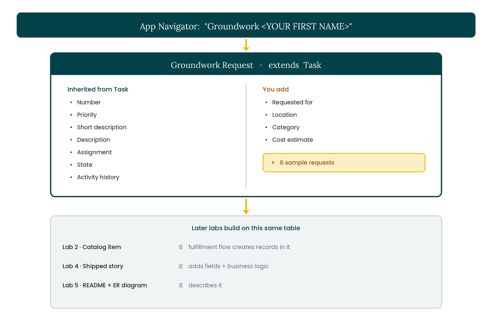
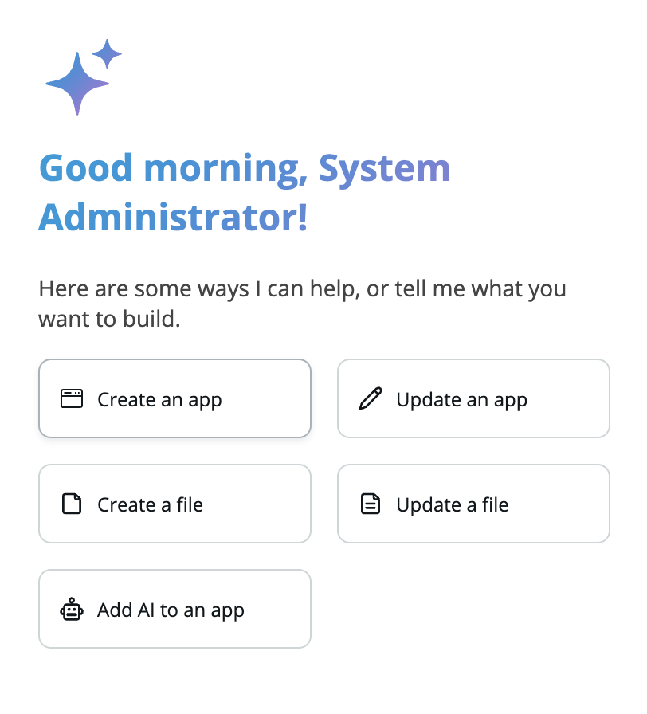
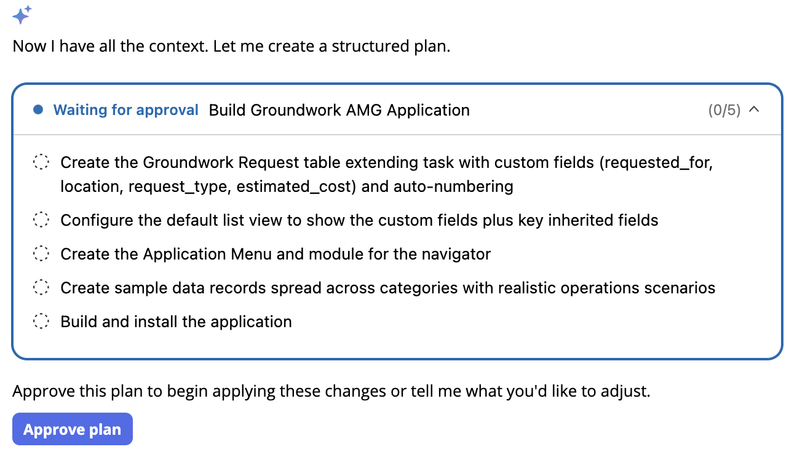
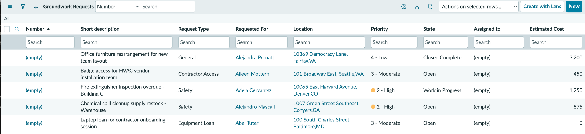

# Lab 1 · Creating the Foundational App

Still in your second tab, with the plugin installing in tab one, start creating an app. **Groundwork** is a work and service request tracker. Facilities team, campus operations, plant site, school district, jobsite: same shape everywhere. You will make it yours over the next four labs.

Here is what the one prompt will create, and where the later labs plug in:

<figure><figcaption><p>Click on image to zoom in</p></figcaption></figure>

The solid box is what you build in this lab: a Groundwork Request table that extends Task, inheriting the standard request fields so you add only what is specific to operations. The greyed box is what the later labs add on top.


**IMPORTANT — Your app needs a unique name**. Use "_Groundwork_" plus your first name, wrapped in quotes, example: "_Groundwork Andreea_". Replace the bracketed placeholder with your actual first name.


<figure><figcaption><p>Click on image to zoom in</p></figcaption></figure>

### Prompt 1 (swap in your name)


```
Create a new application called "Groundwork <YOUR FIRST NAME>". It tracks work and service requests for an operations team.
Build it by extending the platform's Task record into a new table called Groundwork Request, so it reuses the standard fields we already get: a request number, priority, the short and full description, assignment, state, and activity history. Do not rebuild those.
On top of the inherited fields, capture what is specific to us: who the request is for, the location or site (with a reference to the Location table), the type of request (General, Equipment Loan, Safety, or Contractor Access), and an estimated cost.
Make sure the fields you add appear on the Groundwork Request form and in its default list view, and fill them in on the sample data.
Add a handful of realistic sample requests spread across the categories, and make the Groundwork Request list reachable from the application navigator.
```


While it builds (about 5 minutes): read Lab 2 so you are ready to build the catalog front door next. Glance at tab one to see how the plugin install is progressing.


**TIP — Be on the lookout for an approval.** Build Agent will sometimes create a plan before it builds, especially when the task is more complex. If you see a plan, read it and then approve it to continue. That approval is the human-in-the-loop gate, not an error.


<figure><figcaption><p>Click on image to zoom in</p></figcaption></figure>

### Verify

* Just like in traditional development, you should always review that requirements have been implemented as expected.
* In a new tab, open the App Navigator (the All menu), find your Groundwork app, open the Groundwork Request list. The app might take a few seconds to show up in the app navigator. Refresh the app navigator a few times, as needed.


**TIP — Can't find the Application Menu?** Tell Build Agent you can't find it. Build Agent can debug that for you.


* Check that the sample requests exist. Confirm the fields you added (Requested for, Location, Category, Cost estimate) are visible on the form and list, on top of the standard fields inherited from Task (number, priority, description, state).

<figure><figcaption><p>Click on image to zoom in</p></figcaption></figure>


**Missing a field or two?** Do not rebuild. Tell Build Agent, example: "Also add the Cost estimate field to the Groundwork Request table." That is the iteration loop working.



**Feature Spotlight: plans before changes.** Notice that Build Agent showed you a plan and waited. Nothing was created until you approved. This approval gate is the core governance pattern: the agent proposes, you dispose.

