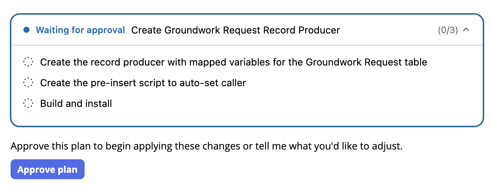
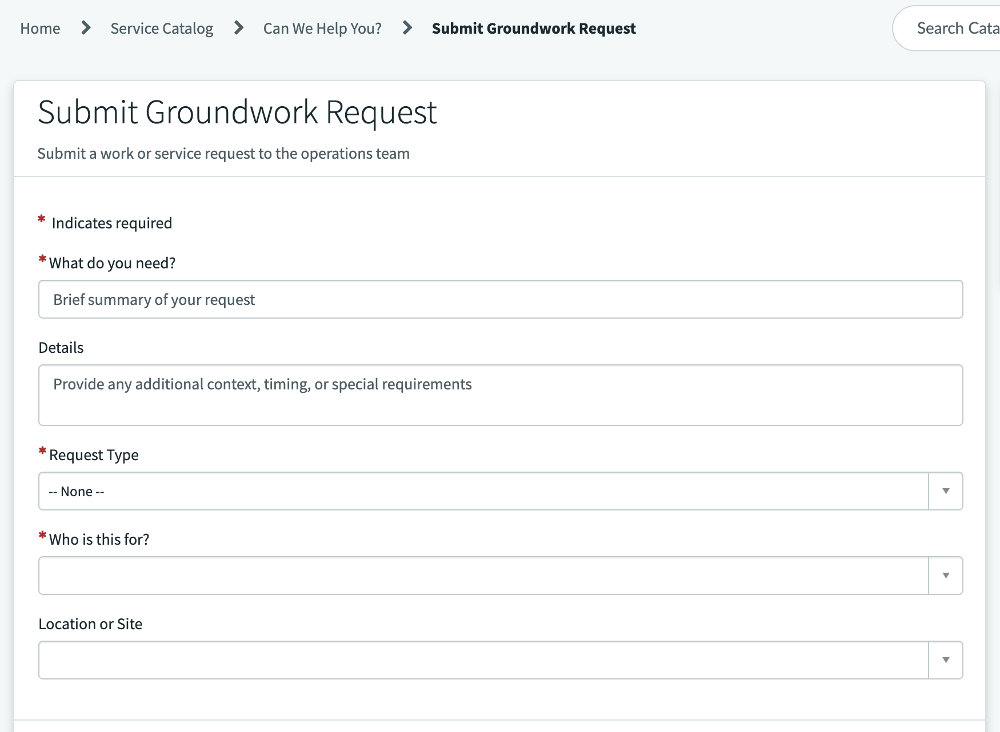
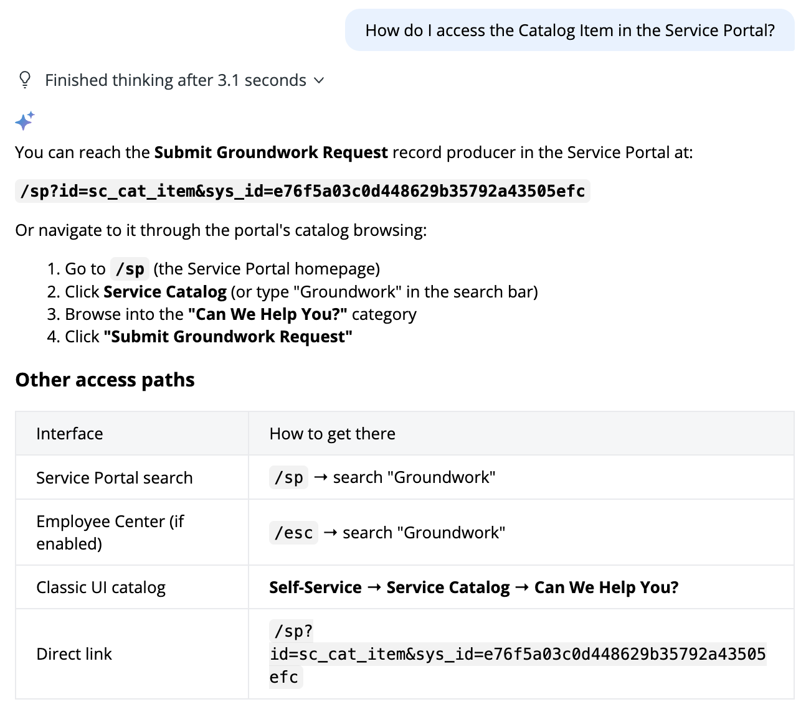
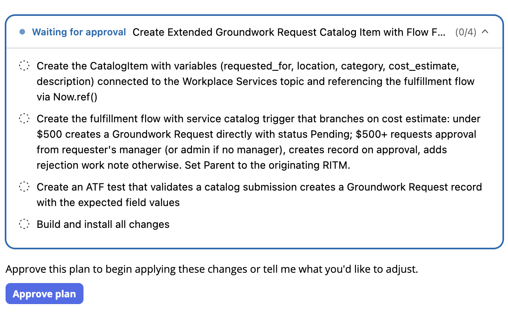
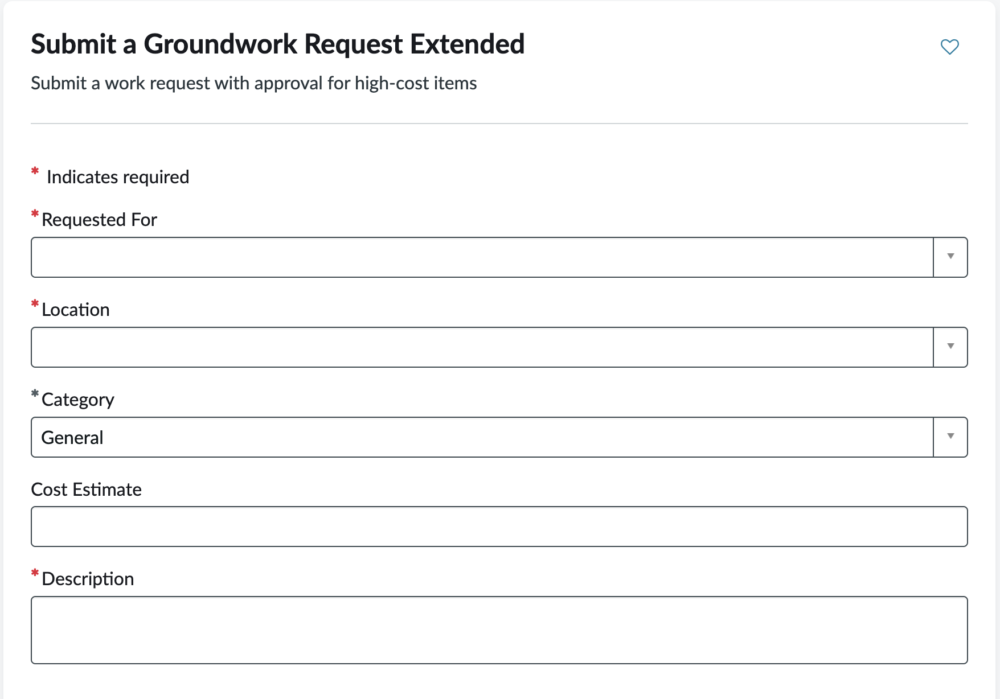
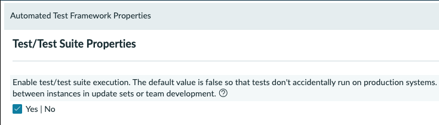

# Lab 2 · The Front Door: A Catalog Item

You have a table and some data. Now give people a way to file a request without touching the backend. Building the catalog item teaches you how much the quality of your ask shapes what the agent produces, and that lesson pays off when you implement a real story in Lab 4.

### Round 1: the vague ask

This is the requirement as it usually arrives in your inbox: underspecified, and technically enough to start.

#### Prompt 2a

```text
Create a catalog item so employees can request work. Give it a sensible name and let people submit a basic request.
```



Approve it. Look at what you get. It will be generic, and that is the point: vague in, vague out. Note what is missing (which fields? where do submissions go? any approval? how would anyone even find it?) before moving on.




**TIP — If you can't find the Catalog Item**, simply ask Build Agent to tell you how to access it in the Service Portal.




### Round 2: the real requirements

Now the BA has done their job and you have more extensive requirements. Send the full requirements as one prompt. **Build Agent** will stand up a fresh catalog item rather than editing the round-1 draft.

#### Prompt 2b

```text
Create a new catalog item using these requirements:
Name: Submit a Groundwork Request Extended.
Variables: Requested for (reference to user, mandatory), Location (reference to Location, mandatory), Category (choice matching the Request table categories, mandatory), Cost estimate (decimal), Description (multi-line, mandatory).
Fulfillment: on submission, if the cost estimate is under 500, create a record in the Groundwork Request table mapping each variable to the matching field with status Pending; if the cost estimate is 500 or more, require approval from the requester's manager first, create the record on approval, and on rejection add a work note explaining the outcome instead of creating the record. If the user has no manager, then send the approval directly to admin. Set the new record's Parent to the originating request item so it traces back to the submission it came from. Surface the Parent field on the record form (also in Classic view).
Discoverability: Create a Taxonomy topic called "Workplace Services" under the Employee Taxonomy, if it does not exist. Connect this Catalog Item to the Workplace Services topic under the Employee taxonomy.
Testing: Generate an ATF test that validates a submission creates a Request record.
```


**TIP — Why 2b is the better prompt.** 2a described what you wanted; 2b describes what "done" looks like. A few components make it buildable:

* a concrete name;
* every variable typed and marked mandatory or not;
* fulfillment spelled out (which table, how each variable maps to a field, the starting status, and the approval branch);
* an approval rule with an explicit threshold;
* a discoverability path so people can actually find it;
* and a test the agent can run to prove the item works.

These are the same principles that apply to creating good acceptance criteria: specific, testable, unambiguous. The agent's output quality tracks your input precision, so the skill you are practicing here is requirement writing, not prompt cleverness.



**Prefer not to type all that?** You do not have to hand Build Agent a long typed prompt. You can paste the same requirements as CSV, or attach a screenshot of the requirements doc and ask the agent to implement what it reads.


This build runs a little longer than the others because it also wires up the fulfillment flow and generates a test. The plugin still installing in tab one covers the wait; carry on reading while it works.



### Verify

Open **Employee Center** and search for Submit a Groundwork Request Extended. Submit one, then open your Request list and confirm the record landed with your values, including a Parent link back to the submission. Compare round 1 and round 2.



### Optional · Run the ATF test

Build Agent generated an automated test alongside the item. To run it, open **All > Automated Test Framework > Tests**, open the generated test for the item, and click Run Test. It spins up a throwaway user, orders the item, and confirms a Request record was created with the right field mappings. Running tests depends on the ATF test-execution property being enabled; your lab instance might not have it on. Back home, enable test execution in sub-production only:

Navigate to **All > Automated Test Framework > Administration > Properties**

Check the **Enable test/test suite execution** property.



### Round 3: finish the manual steps, only if needed

Build Agent might end Round 2 with a short list of manual steps it could not complete on its own. This is normal: some records (like linking your scoped catalog item to a global **Employee Center** topic) are cross-scope, and the platform might not let an agent create them for you. The list varies from run to run, so read what the agent gives you and work through it.


**IMPORTANT — Check for manual steps, and ask for help.** Typical leftovers are: activate the fulfillment flow, create or link the Employee Center topic that makes the item browsable, and clean up the draft item from round 1. Work through whatever your agent lists. If any step fights you, flag a lab guru rather than wrestling it alone.


The topic link is the one worth doing together, because it teaches the scope selector. If your agent listed it:

* **Set your session scope.** In the header, open the application scope selector and switch from Global to "Groundwork `<YOUR FIRST NAME>`". The link record must be created in your app scope, not global.
* Navigate to **Service Catalog > Catalog Definitions > Maintain Items** and open Submit a Groundwork Request Extended.
* In the **Topics (Connected Content)** related list, click **New** and select the **Workplace Services** topic. If that topic does not exist yet, create it first under **Employee Center > Taxonomy**, in the **Employee Taxonomy**, then link it.
* Open **Employee Center**, browse to the **Workplace Services** topic, and confirm the item now appears there, not just in search.


**Feature Spotlight: scope is the guardrail.** The friction you just felt is deliberate. Scope is the boundary that stops one application (or an agent working inside it) from silently reaching into another. The same boundary is what lets update sets travel cleanly and what makes safe promotion between instances possible. When an agent says it cannot do something across scopes, that is the platform protecting you, not failing you.



**Feature Spotlight: update sets, automatically.** Everything Build Agent changed today has been tracked in update sets without you doing anything. In Studio you can review them, revert pieces, and deploy through your normal release process. Agentic development still travels through the governance you already have.

