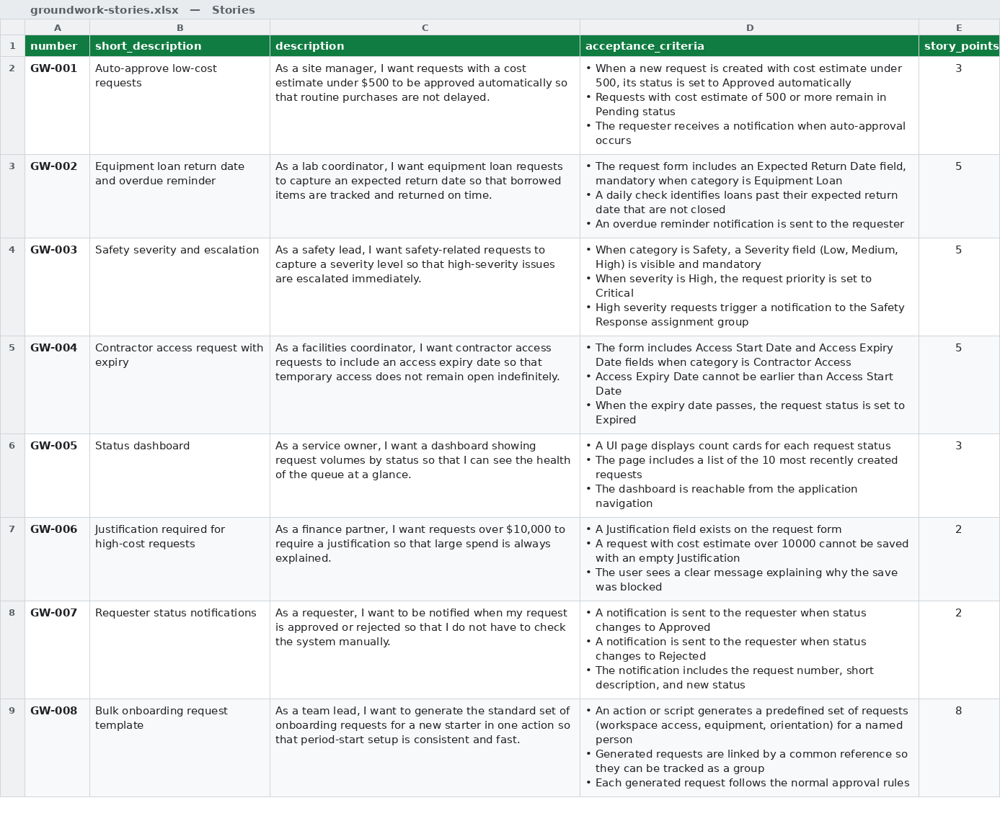
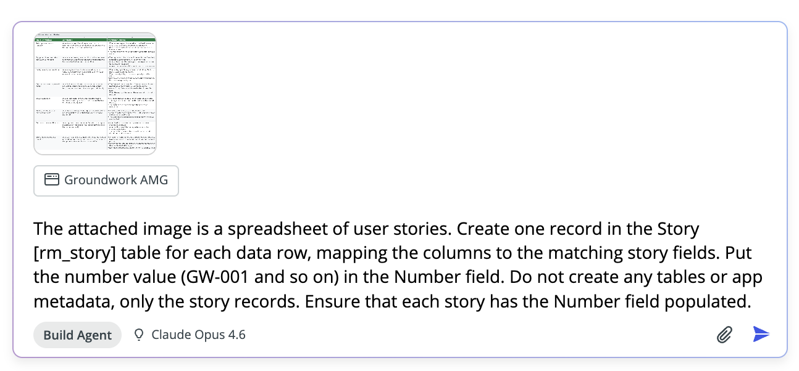
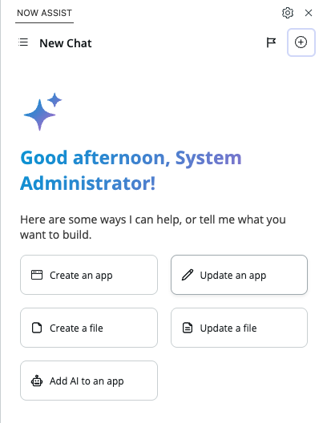
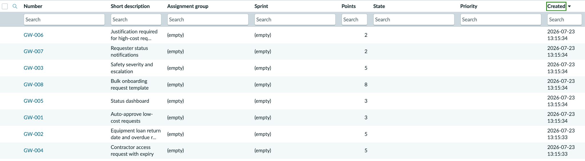

# Lab 3 · Load Your Backlog

**Goal:** eight user stories in the platform backlog, ready to be worked.


**TIP — Where this is heading.** We load stories into the Story (`rm_story`) table today, part of Agile Development 2.0, which ServiceNow is deprecating in favour of Collaborative Work Management. Your data is safe and there is no forced migration. The direction that matters for this workshop: the platform is moving toward agents reading work items and building against them with a human in the loop, exactly the pattern you practice here. Treat `rm_story` as today's mechanism, not the long-term one.



**IMPORTANT — Check the plugin first.** This lab writes to the Story \[`rm_story`] table, which the plugin from Lab 0 provides. Switch to tab one and confirm the install has completed before you start. If it is still running, give it a minute; scaffolding and the catalog should have bought enough time.


At work, requirements do not arrive as beautiful prompts. They arrive as spreadsheets. So that is exactly what you will hand **Build Agent**: an image of a spreadsheet of user stories. Build Agent reads the image and creates the records for you.

* Download the stories image below.
* In your existing chat, attach it to the Build Agent chat using the attachment control. Confirm the attachment chip appears before you send.
* Send the attachment together with this prompt, in the same message:

<figure><figcaption><p>Click on image to zoom in</p></figcaption></figure>


**To save this image:** right-click (or press and hold on trackpad) the image above and choose **Save Image As…** (or **Download Image**), then attach the saved file to your Build Agent chat.


### Prompt 3


```
The attached image is a spreadsheet of user stories. Create one record in the Story [rm_story] table for each data row, mapping the columns to the matching story fields. Put the number value (GW-001 and so on) in the Number field. Do not create any tables or app metadata, only the story records. Ensure that each story has the Number field populated.
```


<figure><figcaption><p>Click on image to zoom in</p></figcaption></figure>


**TIP — If you encounter issues here**, flag down a guru. Issues you might encounter include:

* Build Agent claims it can't create the stories due to a cross-scope access issue and asks you to run a Background Script. The usual cause for this is that your chat has run out of context window and has started to hallucinate. The fix for this is to:
  * Open a new Chat from the plus sign at the top right corner of the Build Agent chat window
  * Click on Update an App
  * Select your Groundwork App
  * Resubmit the prompt

Build Agent will not set the Number field on the Story for you. Build Agent will often rely on ServiceNow to automatically number records, which does not happen when using the Record API to insert records.


<figure><figcaption><p>Click on image to zoom in</p></figcaption></figure>

### Verify

* Ask Build Agent: "List the stories you just created with their short descriptions." Confirm all eight (GW-001 to GW-008).
* Spot-check one story against the printed list below. Pay attention to numbers: a $500 threshold that became $5,000 matters. You can find the list of stories in the instance by typing "rm\_story.list" in the **App Navigator** (the App menu).

<figure><figcaption><p>Click on image to zoom in</p></figcaption></figure>


**IMPORTANT — If the image will not ingest.** Use the copy-paste variant in [Appendix A](appendix-a-paste-fallback.md). Same stories, same result.


### The backlog

|    #   | Story                                                 | Flavor              | Pts |
| :----: | ----------------------------------------------------- | ------------------- | :-: |
| GW-001 | Auto-approve requests under $500; others stay Pending | General             |  3  |
| GW-002 | Equipment loan return date + overdue reminder         | Education           |  5  |
| GW-003 | Safety severity field; High escalates to safety group | Energy / utilities  |  5  |
| GW-004 | Contractor access request with access expiry          | Energy / consulting |  5  |
| GW-005 | Status dashboard with count cards + recent list       | Anyone (demo candy) |  3  |
| GW-006 | Block save over $10k without justification            | Anyone              |  2  |
| GW-007 | Notify requester on Approved / Rejected               | Anyone              |  2  |
| GW-008 | Bulk onboarding request generator                     | The ambitious       |  8  |
