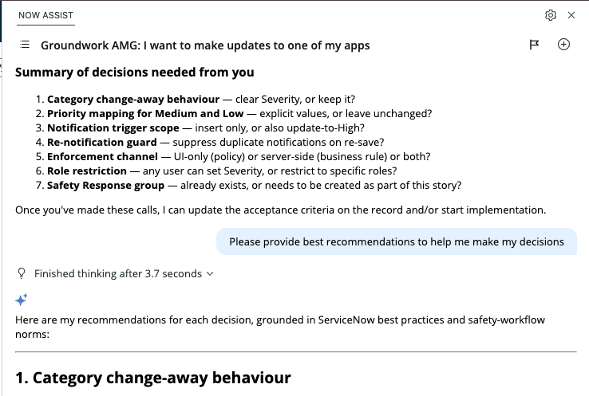
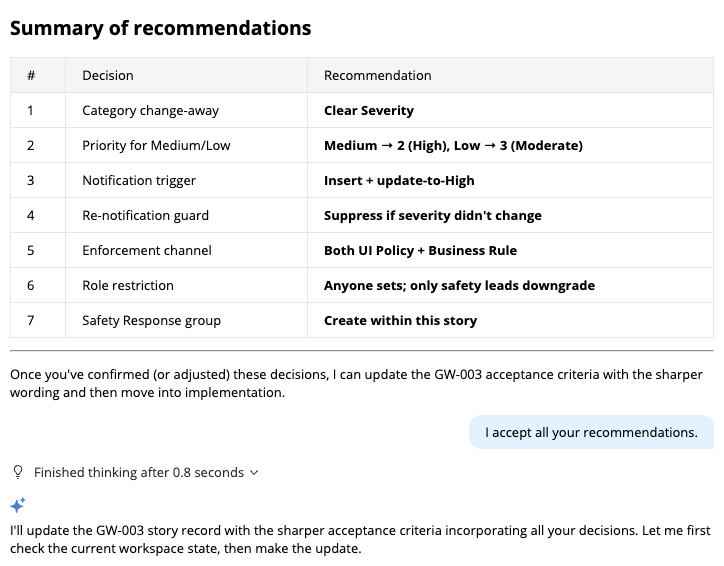

# Lab 4 · Implement a Story

**Goal:** pick one story from the backlog and take it to done, driven by its acceptance criteria.

Pick the story closest to your world: safety escalation if you run a plant, equipment loans if you run a campus, auto-approval if you just want the classic. Points are indicative of complexity: 2s are quick, the 8 is a commitment. We recommend that you start with one of the simpler stories.

### Step 1 · Have Build Agent sharpen the story first

Before you build anything, put the story under review. Real acceptance criteria are often vague, incomplete, or missing an edge case, and an agent will happily build exactly what a weak story says. Ask first:

#### Prompt 4a (swap in your story number)

```text
Read the story in the rm_story table with Number GW-003. Do not build anything yet. Review its acceptance criteria: are they testable, complete, and unambiguous? Point out any gaps, edge cases, or missing conditions I should decide on before implementation, and suggest sharper wording.
```

Read the response. It will be thorough, often a list of eight or ten decisions. You do not need to resolve them all: pick the two or three that actually change the build, decide those, and move on. This is the requirements-quality lesson from Lab 2, now applied to a story you are about to implement yourself. You can also ask **Build Agent** to make suggestions for the best course of action.



### Step 2 · Review the plan and approve



Once you accept the refinements, **Build Agent** moves straight to an implementation plan and waits for your approval. There is no separate "now build it" prompt. If it starts building without showing a plan, or you want the plan tied to each criterion, ask:

#### Optional

```text
Before you make any changes, show me the plan and map each step to the acceptance criterion it satisfies.
```

Read the plan properly. This is the skill. Does every acceptance criterion appear? Is it creating things you did not ask for? Push back before approving: "Skip the extra dashboard, just satisfy the three criteria."

### Verify

Test against the acceptance criteria. GW-003 example: create a Safety request, confirm Severity appears and is mandatory, set it High, confirm priority flips to Critical.


**TIP — Let the agent write the test plan.** Not sure how to test it? Ask Build Agent: "How do I test this?" It returns a checklist organized by acceptance criterion (visibility, escalation, the normal path). Walk through it, then run the ATF test the same way you did in Lab 2 if you want the automated proof.



**Feature Spotlight: checkpoints and the change log.** Open the conversation change log tab in Studio. Every change Build Agent made is tracked there, grouped by conversation, with checkpoints you can roll back to. This is your safety net at work: if an approved plan turns out wrong, you revert to the checkpoint instead of hand-unpicking metadata. Changes are also captured in update sets automatically.


### Finished early? Additional optional tasks:

* **Extend your app, no story.** Think of one small thing Groundwork could use (a photo of the issue, a Department field with a filtered list) and iterate it in. You do not need a ticket to improve an app.
* **Break something, then roll it back.** Make a deliberately bad change, then Restore from the change log. Feel the safety net for real.
* **Add the dashboard.** Ship GW-005: count cards plus a recent-requests list. Instant demo candy.
* **Add a second front door.** A quick "Report a Safety Hazard" catalog item that pre-sets Category to Safety.
* **Or build something completely different and fun.** Your own idea, from scratch. Start a fresh chat for this one, since it is a new app and a new unit of work, and give it a unique name like you did in Lab 1.
