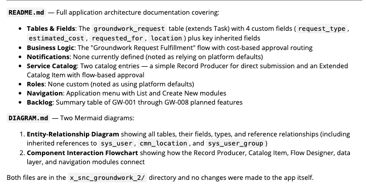
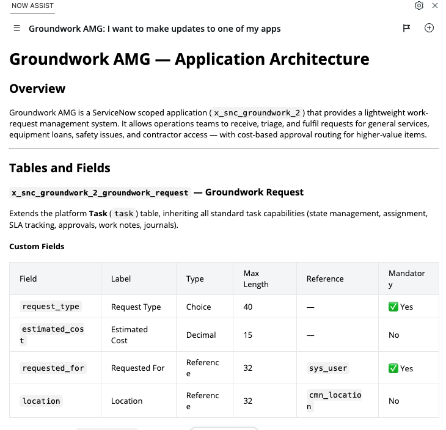

# Lab 5 · Document What You Built

Your Groundwork is no longer the app you created this morning. It has a catalog front door, your shipped story, maybe a second story. Documentation that writes itself from the current state is the last step of the morning:

### Prompt 5

```text
Document this app. Create a README describing the application architecture: tables and fields, business logic, notifications, the catalog item, and roles. Then generate a diagram showing all tables, fields, and relationships in this application. Do not make any changes to the app. Display the documentation inline.
```

### Verify

Open the README in the File Explorer. Read it as if you inherited this app from a contractor who left. Would you know where the escalation logic lives? If a section is thin, ask for more: "Expand the business logic section with trigger conditions."






**Feature Spotlight: documentation as a zero-risk first step.** Documenting an app makes no changes, which makes it the safest possible first Build Agent task back home: open an existing custom app and ask for a summary of its architecture, data model, roles, and key components. Useful output, zero risk.


## Wrap up

You did five things this morning:

* Created a basic app from one prompt.
* Built and iterated a catalog front door, and saw why requirements quality is the real skill.
* Loaded a backlog from a spreadsheet image.
* Implemented a story driven by its acceptance criteria, after having the agent sharpen it first.
* Generated documentation from the app as it actually is.

Part Two takes the same app to the command line: continue to [Build Anywhere](../build-anywhere/README.md).
