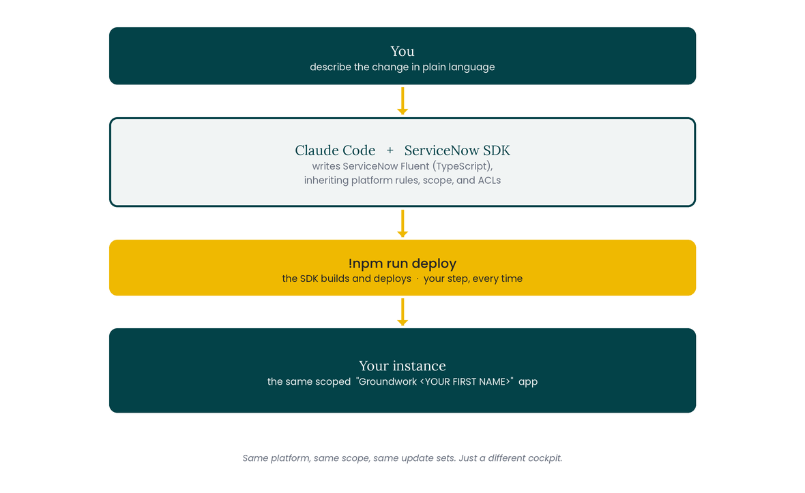

# Part Two - Build Anywhere

This morning you drove **Build Agent** from inside the platform. This afternoon you drive an AI coding agent from outside it. Claude Code writes ServiceNow Fluent (the platform's TypeScript authoring language), the ServiceNow SDK compiles that into real platform artifacts, and it deploys into the same scoped Groundwork app you already built. Same instance, same scope, same update sets, a different cockpit.

Here is the loop for the afternoon:

<figure><figcaption>
Click on image to zoom in
</figcaption></figure>

The platform, scope, and update sets are identical to the morning. Only the tool you hold has changed.

## What you will accomplish this afternoon

| Lab                   | What you build                                                 | The skill underneath                             |
| --------------------- | -------------------------------------------------------------- | ------------------------------------------------ |
| 6 · Connect           | Point a Fluent project at this morning's app and pull it local | Reaching an existing app from outside the UI     |
| 7 · Ship from the CLI | Another backlog story, written in Fluent and deployed          | Plan mode + review as the approval gate, in code |
| 8 · AI skill          | A Now Assist skill that triages a request                      | AI is just another governed Fluent artifact      |


**Before you start: your Codespace is ready.** The GitHub Codespace from your invite is pre-provisioned: the ServiceNow SDK and packages are installed, and a Claude API key is already wired to your account. The one thing you set up by hand is the connection to your own lab instance. If your Codespace is not open yet, open it from the repository now; it takes a minute to spin up.


Ready? Start with [Lab 6: Connect to Groundwork from the Command Line](lab-6-connect.md).

Looking for how this compares to the morning? See [Build Agent or Build Anywhere?](build-agent-vs-build-anywhere.md)
