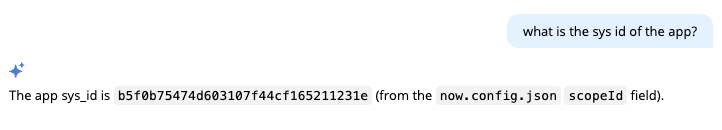
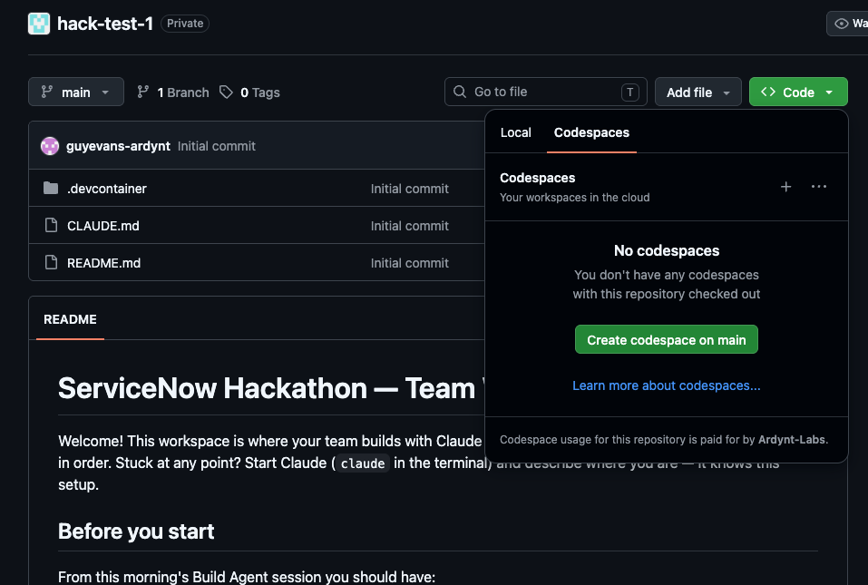
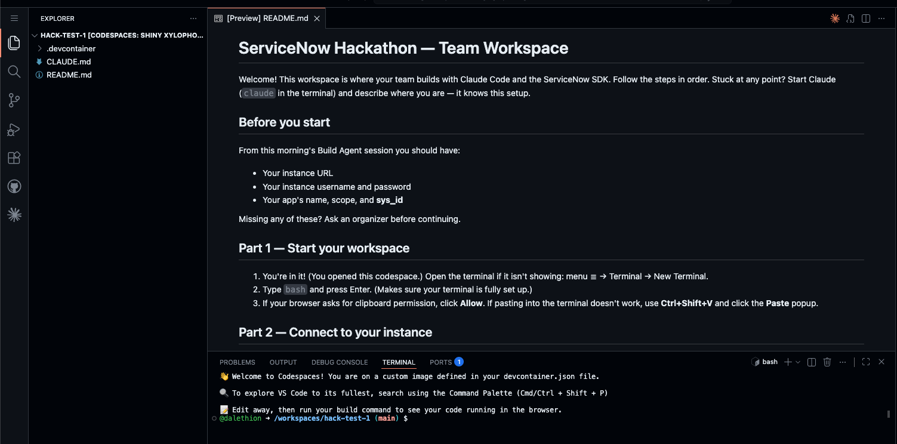
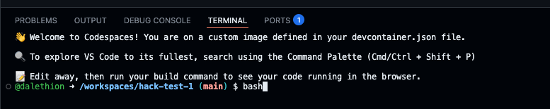
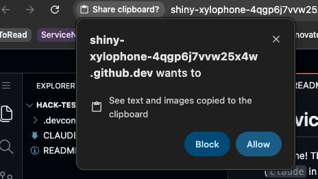
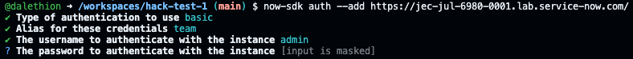
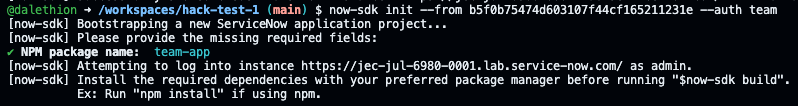
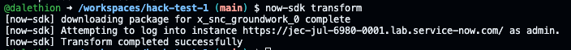
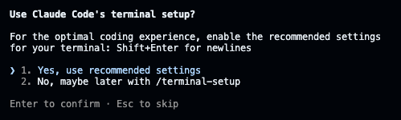
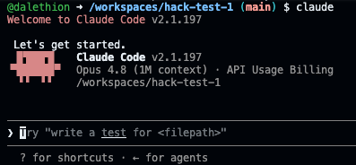

# Lab 6 · Connect to Groundwork from the Command Line

Your Groundwork app is sitting on your instance. Moving to the command line changes none of that. You will authenticate the SDK to the instance, pull your existing scoped app down as Fluent source, and confirm you can see it locally.


**IMPORTANT — You will need four data items to finish this configuration.**

* Your instance URL, username, and password are all on your instance reservation page — the same page you used this morning. The password is hidden; click the lock icon to reveal it.
* The one thing not on that page is your Groundwork app's sys\_id: get it from your app in Studio (or the sys\_app record), or simply ask Build Agent in your instance, "What is the sys\_id of my application?"
* We recommend that you capture these 4 items in your note-taking software of choice, e.g Notepad, OneNote.


<figure><figcaption><p>Click on image to zoom in</p></figcaption></figure>

<figure><figcaption><p>Click on image to zoom in</p></figcaption></figure>

### Step 1 · Start your Codespace

* Open your team repository link (from the organizers). Use the provided GitHub credentials to sign in. These were shared to the email address you signed up for the workshop with prior to today. If you have any trouble signing in or finding the credentials, please flag one of the gurus.
* On the repository page, click the green Code button (top right of the file list), switch to the Codespaces tab, then **Create codespace on main**.

<figure><figcaption><p>Click on image to zoom in</p></figcaption></figure>

* A new browser tab opens and **the workspace builds for a few minutes (up to 5 minutes)**; wait for VS Code to appear. (Coming back later? The same **Code > Codespaces** menu lists your existing codespace — click its name to reopen it instead of creating a new one.)

<figure><figcaption><p>Click on image to zoom in</p></figcaption></figure>

* When VS Code opens, open a terminal if one is not showing: menu (three lines) > Terminal > **New Terminal**. Type bash and press Enter.

<figure><figcaption><p>Click on image to zoom in</p></figcaption></figure>

* Paste tip: if the browser asks for clipboard permission, click Allow. If pasting into the terminal does not work, use Ctrl/Cmd+Shift+V and click the Paste popup.

<figure><figcaption><p>Click on image to zoom in</p></figcaption></figure>

* The README file included lists the setup steps, so you can easily follow along.

### Step 2 · Connect, pull your app in, and start Claude

Run these in order. Replace the parts in capitals with your own values. If you are new to the command line, we recommend that you first paste these commands in your note-taking app, fill in with the values in the note-taking app, and then you can paste the full command in the terminal.

<figure><figcaption><p>Click on image to zoom in</p></figcaption></figure>

**1.**


```bash
bash
```


Reloads all the tools we have pre-loaded in this Codespace for you. This is very important to do at the beginning of each Codespace session.

**2.**


```bash
now-sdk auth --add https://YOUR-INSTANCE.service-now.com
```


Registers your instance and stores your login so the SDK can talk to it. Answer the prompts in order. Select / type answers exactly as indicated. Hit Enter after each one.

* **auth type** `basic`
* **alias** `team`
* then provide you username and password (the password stays hidden as you type, which is normal)

<figure><figcaption><p>Click on image to zoom in</p></figcaption></figure>

<figure><figcaption><p>Click on image to zoom in</p></figcaption></figure>

<figure><figcaption><p>Click on image to zoom in</p></figcaption></figure>

<figure><figcaption><p>Click on image to zoom in</p></figcaption></figure>

**3.**


```bash
now-sdk init --from YOUR_APP_SYS_ID --auth team
```


Creates a local project mirroring your existing app.

* `--from <sys_id>` tells it which app to pull;
* `--auth team` uses the credentials you just saved.

This is the "adopt your morning app" step. When it asks for an NPM package name, type `team-app` (do not change this) and press Enter.

<figure><figcaption><p>Click on image to zoom in</p></figcaption></figure>

**4.**


```bash
npm install
```


Downloads the Node packages the project depends on (listed in its package.json). One-time, takes a moment. You might get some warnings, they are irrelevant to our workshop.

**5.**


```bash
now-sdk transform
```


Converts the pulled app metadata into editable Fluent (TypeScript) source in the project. Wait for "Transform completed successfully."

<figure><figcaption><p>Click on image to zoom in</p></figcaption></figure>

**6.**


```bash
claude
```


Launches Claude Code inside the project so you can prompt it. First time only: accept the setup questions and choose Yes to use the API key (even though it labels it "No (recommended)" — it is pre-wired for the lab).

Hit Enter at the first screen as seen below:

<figure><figcaption><p>Click on image to zoom in</p></figcaption></figure>

Select Option 1 and hit Enter:

<figure><figcaption><p>Click on image to zoom in</p></figcaption></figure>

Hit Enter:

<figure><figcaption><p>Click on image to zoom in</p></figcaption></figure>

Hit Enter:

<figure><figcaption><p>Click on image to zoom in</p></figcaption></figure>

Hit Enter (Codespaces do not store anything on your machine):

<figure><figcaption><p>Click on image to zoom in</p></figcaption></figure>

You are in.

<figure><figcaption><p>Click on image to zoom in</p></figcaption></figure>

Follow the labs below to tell Claude what to build and approve its steps (**"Yes, and don't ask again"** is fine). When it hands you a deploy command, you run it yourself by typing `! npm run deploy` (the exclamation mark is important). Don't worry, Claude will remind you what the command is if you forget.


**Feature Spotlight: same scope, new cockpit.** The SDK authenticated to the instance separately from your browser, and it deploys into the very same scoped application. Scope, ACLs, and update sets all still apply. The governance you met this morning did not disappear because you changed tools; it travels with the app.

