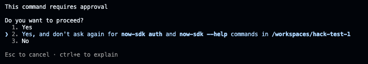
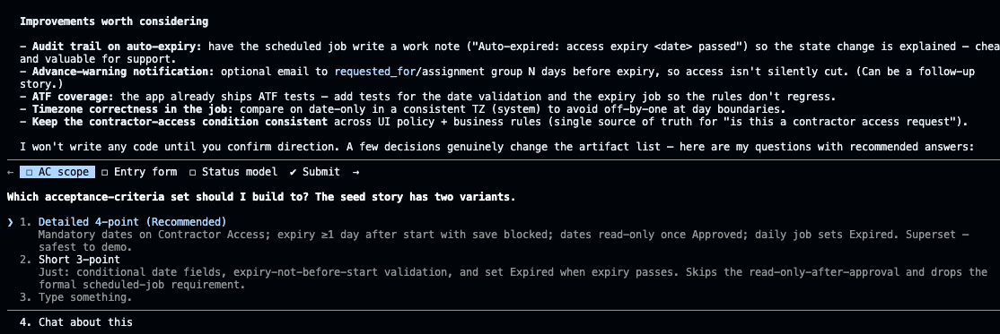
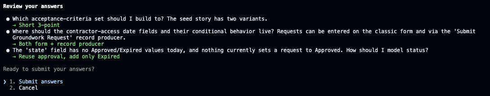
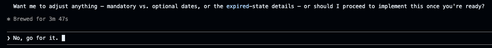
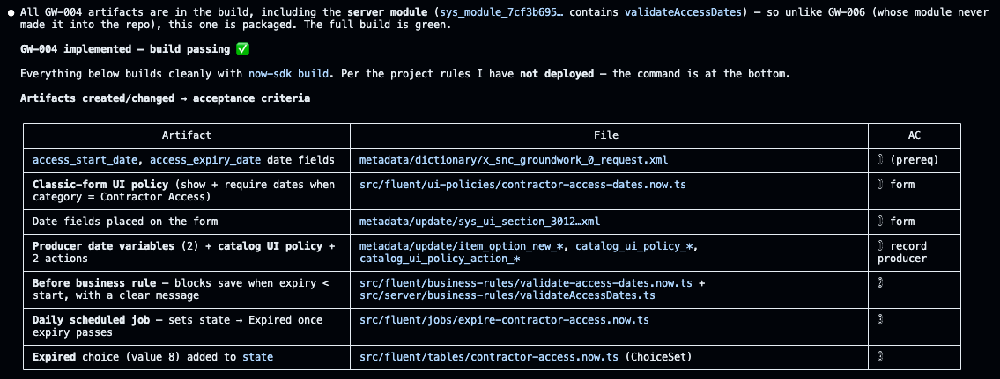

# Lab 7 · Ship Another Story from the Command Line

**Goal:** take a second backlog story to be done in Fluent, and deploy it from the command line interface (CLI).

Same discipline as this morning, different surface. Pick a story you did not ship in Lab 4. **GW-006** (block a save over $10k without a justification) is the clean worked example: a field plus a validation rule, which maps neatly to Fluent. GW-002 (equipment loan return date and overdue reminder) is a good alternative if you want something more complex.


**Note on the screenshots below.** They walk through the plan → build → deploy flow using **GW-004** (Contractor Access) as the worked example. The pattern is identical whichever story you pick — read them as an illustration of the flow, not a literal GW-006 walkthrough.


### Step 1 · Plan before code

Use Claude Code's plan mode so you review the approach before anything is written. This is the command-line version of **Build Agent**'s approval gate.

#### Prompt 7a (plan mode)


```text
Read the story GW-006 from the rm_story table on my instance. Then, in plan mode, propose how you would implement it in this app. List the artifacts you would create or change and map each one to an acceptance criterion. Suggest any improvements you think are worthwhile. Ask me questions as needed to clarify requirements, but also provide me your recommended answers. Do not write code yet.
```



**Expect a lot of approvals.** To read the story, Claude runs a series of now-sdk query commands and asks you to approve each one ("Do you want to proceed?"). That is normal. Choose "Yes, and don't ask again" to stop the repeated prompts and let it work.

<figure><figcaption><p>Click on image to zoom in</p></figcaption></figure>



**Can't reach the instance? Check bash.** If Claude says it lacks tools or cannot read your instance, you probably skipped the bash step in Lab 6. Exit Claude, type bash, and start claude again — that loads the now-sdk tools it needs. You don't need to reconnect to the instance, you can proceed with the lab. As a fallback you can paste the full story text, or drag the stories image into the terminal.



**Optional, for the curious.** The now-sdk gives Claude tools to query your instance directly, which is how it reads rm_story. More broadly, connecting an AI agent to a live system uses the Model Context Protocol (MCP): a small, secure connector that exposes a system like ServiceNow to the agent so it can read records and act. Many organizations are now building their own ServiceNow MCP servers for exactly this.


<figure><figcaption><p>Click on image to zoom in</p></figcaption></figure>

<figure><figcaption><p>Click on image to zoom in</p></figcaption></figure>

### Step 2 · Approve the plan, then build and deploy

When the plan looks right, approve it. Claude then makes all the edits without stopping to ask on each one. Claude might still ask you for additional permissions to run commands as it starts implementing.

<figure><figcaption><p>Click on image to zoom in</p></figcaption></figure>

As it works, Claude shows a plain summary of what it changed: which fields, rules, and files. Read it like a change summary — it lets you catch anything wrong before it goes live. If something looks off, tell Claude to fix it before you deploy.


**IMPORTANT — Deploy it.** When the changes look right, deploy from inside Claude with `!npm run deploy`. Nothing is on your instance until you do this.


<figure><figcaption><p>Click on image to zoom in</p></figcaption></figure>

### Verify

After you deploy, Claude hands you an acceptance-test table: the steps, the expected result, and which acceptance criterion each one checks. Run it on a saved Groundwork Request. For GW-006 that means trying to save a request over $10,000 with no justification and confirming it is blocked with a clear message.


**Feature Spotlight: the plan is your gate, and you can undo.** Reviewing the plan before auto mode is the command-line version of Build Agent's approve step, and the change still lands in source control and an update set. The deploy also returns a rollback link to undo the install if you need it — the same safety net as this morning's checkpoints.

