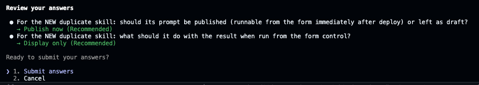
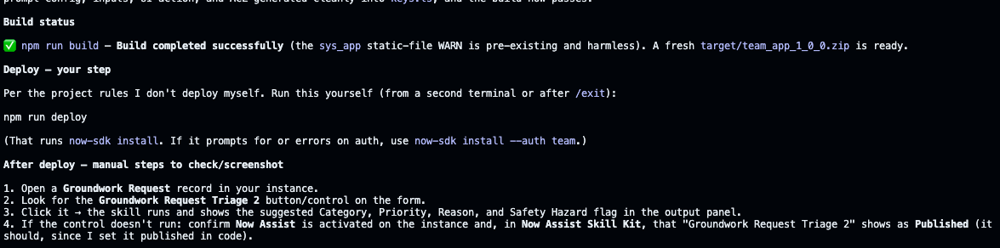

# Lab 8 · Add an AI Skill: Request Triage

The platform's AI capabilities are authorable from the SDK too. You will build a **Now Assist AI Skill** that reads a Groundwork Request's description and suggests a Category and a Priority, flagging anything that looks like a Safety issue. It is the triage a coordinator does by hand, offered as a one-click suggestion on the form.

### Prompt 8


```text
Create a Now Assist AI skill in this app that takes a request's short description and description as input and returns a suggested Category (one of General, Equipment Loan, Safety, Contractor Access), a suggested Priority, and a one-line reason. Flag when the text suggests a safety hazard. Make it runnable from a control (button) on the Groundwork Request form, and create that control for the classic form view as well, not only the workspace view. Make sure that any suggestions returned are human readable and formatted in a user-friendly way. Build it when you are done; I will run the deploy myself. Ask me about anything you need clarification on.
```


<figure><figcaption><p>Click on image to zoom in</p></figcaption></figure>


**Deploy it.** When the changes look right, deploy from inside Claude with `!npm run deploy` (run `!npm run build` first if asked). Nothing is on your instance until you do this.


* After you deploy, follow the verify steps Claude prints: open a Groundwork Request record, find the triage control on the classic form, click it, and confirm it returns a suggested Category, Priority, reason, and Safety Hazard flag in the output panel. Try a description that mentions a hazard (a gas leak, an injury) and confirm it flags Safety.

<figure><figcaption><p>Click on image to zoom in</p></figcaption></figure>


**TIP — Your first output might look rough.** Raw text, escaped line breaks, a blunt banner. That is the starting point, not the finish line. Iterate on the skill: ask it to return clean, separate fields, tighten the reasoning, add or drop an output, adjust the prompt until it reads the way you would want on a real form.



**Feature Spotlight: AI is just another governed artifact.** The skill you built lives in your application scope, respects the same ACLs, and travels in the same update set as everything else. The model runs through the GenAI provider configured on the instance. Adding AI did not step outside the governance you already have.


Ready to see how the two approaches stack up? [Build Agent or Build Anywhere?](build-agent-vs-build-anywhere.md)
