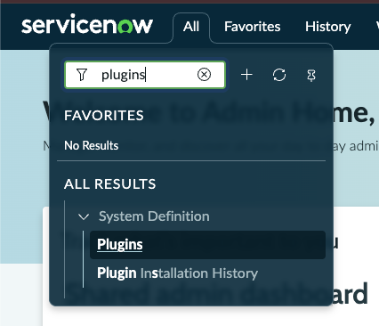
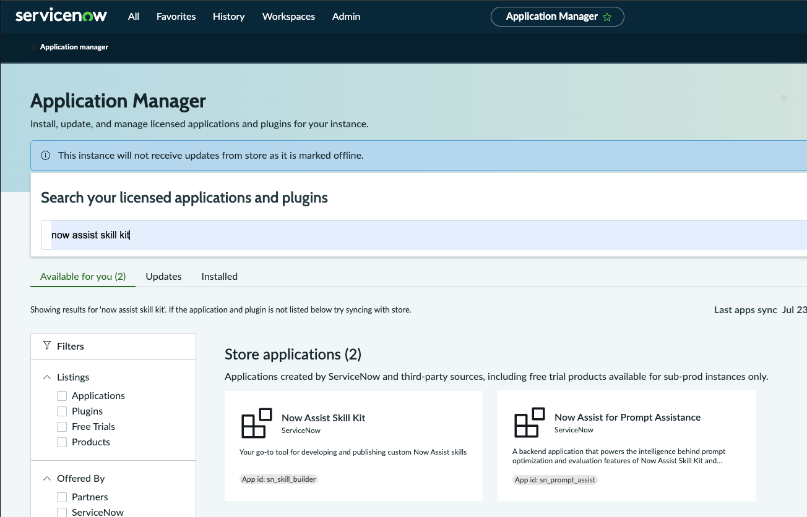
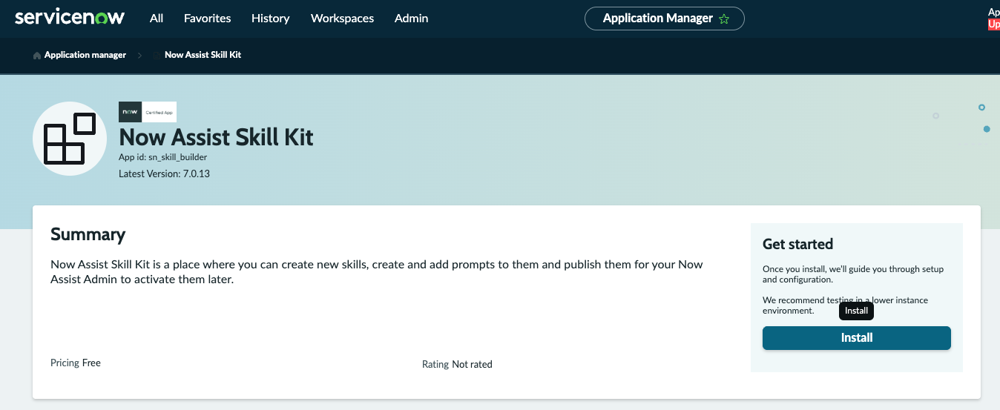
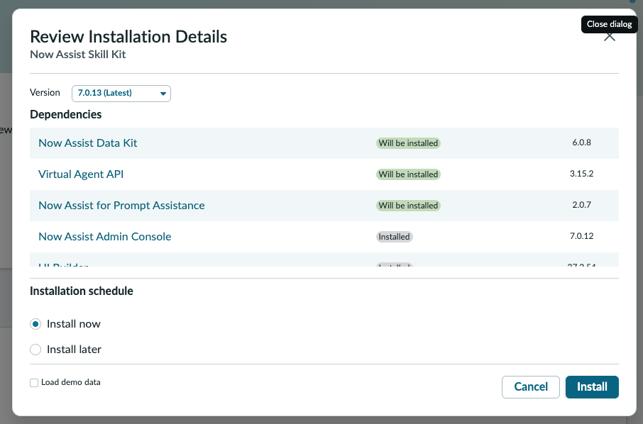

# The Pre-Lunch Lab

Lab 8 this afternoon builds a Now Assist AI Skill, which needs the **Now Assist Skill Kit** installed on your instance. Like this morning's plugin, it takes a few minutes, so start it now and use the wait productively.

### Step 1 · Start the install

Navigate to the Application Manager: use the **All** menu search and type "plugins" to find **System Definition > Plugins**.

<figure><figcaption>
Click on image to zoom in
</figcaption></figure>

Search "now assist skill kit". You will see two results: **Now Assist Skill Kit** (App ID `sn_skill_builder`) and its dependency, **Now Assist for Prompt Assistance**. Open **Now Assist Skill Kit**.

<figure><figcaption>
Click on image to zoom in
</figcaption></figure>

On the app page, click **Install**.

<figure><figcaption>
Click on image to zoom in
</figcaption></figure>

Review the installation details. A few dependencies will be installed alongside it (Now Assist Data Kit, Virtual Agent API, Now Assist for Prompt Assistance); others may already be installed (Now Assist Admin Console, UI Builder). Leave **Install now** selected and click **Install**.

<figure><figcaption>
Click on image to zoom in
</figcaption></figure>


**TIP — While it installs.** Do not sit and wait. Open your Codespace now and get through [Lab 6](lab-6-connect.md)'s Step 1 (starting the Codespace, which takes a few minutes to spin up on its own) while the Skill Kit installs here. By the time you have connected and pulled your app in, the install should be done.

